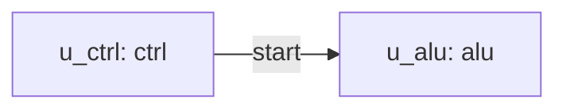

# Verilog 模块结构与连线管理工具开发方案文档

日期：2026-05-13

## 1. 开发目标

构建一个面向 Verilog/SystemVerilog 模块结构管理的工具链，使工程师和 AI 可以共同维护模块、端口、实例、net、连接和参数信息，并从结构化数据稳定生成 Verilog 结构代码和可视化拓扑图。

第一阶段目标是打通最小闭环：

```text
Excel / 已有 Verilog -> 结构化 IR -> 校验 -> Verilog 生成 -> 图形预览
```

第二阶段目标是增加 Web 可视化编辑：

```text
React Flow 编辑器 <-> 结构化 IR <-> 校验/生成
```

## 2. 总体架构

```text
verilog_generator/
  docs/
  schemas/
    design.schema.json
  examples/
    basic_design.xlsx
    basic_design.yaml
  src/
    verilog_generator/
      cli.py
      model.py
      excel_io.py
      rtl_extract.py
      yaml_io.py
      validator.py
      verilog_emit.py
      graph_emit.py
      templates/
        top.sv.j2
  tests/
  web/
    src/
      App.tsx
      components/
      graph/
```

## 3. 数据模型设计

### 3.1 核心实体

| 实体 | 关键字段 |
| --- | --- |
| Module | name、description、parameters、ports |
| Port | name、direction、width、type、required、clock_domain、reset_domain |
| Instance | name、module、parameters、attributes |
| Net | name、width、type、attributes |
| Connection | instance、port、net、slice、comment |
| ParameterOverride | instance、name、value |

### 3.2 Excel 工作簿结构

建议一个工作簿包含以下 sheet：

| Sheet | 用途 |
| --- | --- |
| modules | 模块清单 |
| ports | 模块端口 |
| instances | 实例清单 |
| nets | 内部信号 |
| connections | 端口连接关系 |
| parameters | 参数定义和覆盖 |

### 3.3 连接表建议字段

```text
instance, port, net, net_slice, port_slice, comment
```

示例：

```text
u_alu, clk, clk, , , clock
u_alu, a, alu_a, [31:0], [31:0], operand a
u_alu, y, alu_y, [31:0], [31:0], result
```

## 4. CLI 命令设计

推荐提供以下命令：

```bash
vg import-excel examples/basic_design.xlsx -o examples/basic_design.yaml
vg import-verilog rtl/*.sv -o examples/extracted_modules.yaml
vg export-excel examples/basic_design.yaml -o build/basic_design.xlsx
vg validate examples/basic_design.yaml
vg generate-verilog examples/basic_design.yaml -o build/top.sv
vg generate-graph examples/basic_design.yaml -o build/top.mmd
vg diff old.yaml new.yaml
```

## 5. 校验器设计

### 5.1 Schema 校验

校验字段类型、必填字段、枚举值和基本格式。

### 5.2 引用校验

1. instance 引用的 module 必须存在。
2. connection 引用的 instance 必须存在。
3. connection 引用的 port 必须属于该 instance 对应的 module。
4. connection 引用的 net 必须存在。

### 5.3 硬件语义校验

1. port 与 net 位宽必须一致，除非显式声明 slice 或转换规则。
2. output/inout 驱动同一 net 时需要检查多驱动。
3. required input 不允许悬空。
4. clock/reset 信号需要支持特殊标记和批量连接。
5. bus slice 不能越界。

校验输出建议分为：

```text
ERROR   阻止生成
WARNING 允许生成但提示风险
INFO    信息提示
```

## 6. Verilog 生成方案

使用 Jinja2 模板生成结构代码。

生成内容包括：

1. module header。
2. parameter 声明。
3. wire/logic 声明。
4. 子模块例化。
5. named port connection。
6. 必要的 assign 语句。

生成策略：

1. 输出排序稳定，便于 Git diff。
2. 保留来源注释，例如由哪个 IR 文件生成。
3. 不在生成文件中手写业务逻辑。
4. 每次生成前运行校验器。

## 7. 已有 Verilog 接口提取方案

从已有 Verilog/SystemVerilog 文件中提取“例化需要的信息”，并写入 IR 的 module/port/parameter 区域。

第一阶段提取范围：

1. module 名称。
2. parameter/localparam 中适合例化覆盖的参数名、默认值和表达式文本。
3. input/output/inout 端口名。
4. 端口方向、位宽表达式、数据类型。
5. 源文件路径和声明行号，便于用户追溯。

第一阶段不要求解析完整 RTL 行为，也不要求展开所有宏和 generate 逻辑。遇到复杂语法时输出 warning，并保留原始声明文本供人工确认。

推荐实现：

```text
rtl_extract.py
  -> parse files
  -> extract module interfaces
  -> normalize into IR modules/ports/parameters
  -> report warnings
```

后续根据实际 RTL 复杂度评估 PyVerilog、hdlConvertor、slang 或 Surelog。

## 8. 图形预览方案

第一阶段使用 Mermaid 或 Graphviz 自动生成拓扑图。

Mermaid 示例：



Graphviz 更适合大型图自动布局，Mermaid 更适合 Markdown 文档预览。

## 9. Web 可视化编辑方案

第二阶段开发 React Flow 编辑器。

### 8.1 节点设计

每个 Verilog instance 是一个 node：

```json
{
  "id": "u_alu",
  "type": "moduleInstance",
  "position": { "x": 200, "y": 120 },
  "data": {
    "module": "alu",
    "ports": []
  }
}
```

### 8.2 连线设计

每个连接是一个 edge：

```json
{
  "id": "u_ctrl.start__u_alu.enable",
  "source": "u_ctrl",
  "sourceHandle": "start",
  "target": "u_alu",
  "targetHandle": "enable"
}
```

### 8.3 UI 功能

1. 左侧模块库。
2. 中间画布。
3. 右侧属性面板。
4. 底部校验问题列表。
5. 顶部导入、导出、校验、生成按钮。

## 10. 开发阶段计划

### P0：需求与数据模型确认

产物：

1. 原始需求文档。
2. 技术选型文档。
3. IR 初版样例。
4. Excel 模板草案。

### P1：CLI 最小闭环

产物：

1. `model.py`：Pydantic 数据模型。
2. `excel_io.py`：Excel 导入导出。
3. `rtl_extract.py`：已有 Verilog 接口提取。
4. `yaml_io.py`：YAML 读写。
5. `validator.py`：基础校验。
6. `verilog_emit.py`：Verilog 生成。
7. `graph_emit.py`：Mermaid/Graphviz 生成。

验收：

1. 从 Excel 生成 YAML。
2. 从已有 Verilog 提取模块端口、参数和位宽信息。
3. 从 YAML 生成 Verilog。
4. 从 YAML 生成拓扑图。
5. 测试覆盖基础转换、接口提取和校验规则。

### P2：AI 协同增强

产物：

1. JSON Schema。
2. 局部 IR 导出工具。
3. 修改前后 diff 报告。
4. AI 修改后的自动校验流程。

验收：

1. AI 可以基于局部 IR 增删连接。
2. 错误连接可以被校验器捕获。

### P3：React Flow 可视化编辑器

产物：

1. Web 项目初始化。
2. 模块节点组件。
3. 端口 handle 组件。
4. 连线编辑。
5. 属性面板。
6. 校验问题展示。

验收：

1. 可以加载 IR 并显示拓扑。
2. 可以拖拽模块位置。
3. 可以新增和删除连接。
4. 保存后 IR 可通过 CLI 校验并生成 Verilog。

### P4：工程化集成

产物：

1. CI 校验流程。
2. 示例工程。
3. 文档站点。
4. 版本化 schema。

验收：

1. 每次提交自动运行 IR 校验和生成器测试。
2. 生成结果稳定且可审查。

## 11. 初始里程碑

| 里程碑 | 内容 |
| --- | --- |
| M1 | 完成文档与数据模型样例 |
| M2 | 完成 Excel -> YAML 导入 |
| M3 | 完成 Verilog 接口提取 -> YAML 导入 |
| M4 | 完成 YAML -> Verilog 生成 |
| M5 | 完成校验器和错误报告 |
| M6 | 完成 Mermaid/Graphviz 图生成 |
| M7 | 完成 React Flow Demo |

## 12. 推荐立即执行任务

1. 确认 Excel 模板字段。
2. 创建 `schemas/design.schema.json`。
3. 创建 `examples/basic_design.yaml` 和 `examples/basic_design.xlsx`。
4. 创建 `examples/rtl/` 样例模块，用于验证接口提取。
5. 实现 Python CLI 的 `import-verilog`、`validate` 和 `generate-verilog`。
6. 用一个三模块示例验证完整流程。
